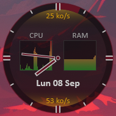
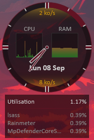
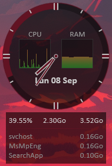

# \[Rainmeter\] AOClock

AOClock is a widget made for [Rainmeter](https://www.rainmeter.net/) on Windows:

It displays the following information:

- Date and time
- Upload activity and speed (top of the clock)
- Download activity and speed (bottom of the clock)
- CPU usage
- RAM usage

---

## Usage:

Hover over the CPU area to display more information:

- Overall CPU usage in percent
- Top 3 processes

Hover over the RAM area to display more information:

- Percentage used, amount used, amount free
- Top 3 processes

Click on the widget to open the Windows tasks manager.

---

## Installation:

You obviously need to install **Rainmeter** first.

Download and install the **AOClock.rmskin** by double-clicking it  

> If you prefer to install it manually, download the widget files to **Documents/Rainmeter/Skins/AOClock**.  
> And install the **SysColor.dll** plugin made by *Brian Ferguson* from his GitHub repository: [brianferguson/SysColor.dll](https://github.com/brianferguson/SysColor.dll/)

You can change the background transparency by editing the **BgAlpha=** line in **@Resources/Settings_Common.inc** (0 = 100% transparent, 255 = 100% opaque)

---

## Translation:

- **Network speed unit:** open **Histogram.ini** or **Round.ini**, depending on which one you're using, and edit **[MeterLANOutText]** and **[MeterLANInText]**

> For example the original `Text="%1o/s"` displays *25 ko/s*, while `Text="%1B/s"` will displays *25 kB/s*

- **Date:** open **MeasureTime.inc** inside the **@Resources** directory and edit **[MeasureDate]**

> `Format=%a %d %b` (see [Format codes](https://docs.rainmeter.net/manual/measures/time/#FormatCodes))
> `Substitute="Jan":"Jan","Feb":"Fev","Mar":"Mar","Apr":"Avr","May":"Mai","Jun":"Jun","Jul":"Jul","Aug":"Aou","Sep":"Sep","Oct":"Oct","Nov":"Nov","Dec":"Dec","Mon":"Lun","Tue":"Mar","Wed":"Mer","Thu":"Jeu","Fri":"Ven","Sat":"Sam","Sun":"Dim"`

- **CPU usage:** open DetailsCPU_RAM.inc inside the **@Resources** directory and edit **[MeterInfoCPU]**

> `Text=Utilisation` in French becomes `Text=Usage` in English

---

## Credits and Third-Party Licenses:

**Widget:** Licensed under GNU GPLv3 by HellPC

**SysColor.dll:** Licensed under GNU GPLv2 or later (GPLv2+) by [Brian Ferguson](https://github.com/brianferguson/SysColor.dll/)
